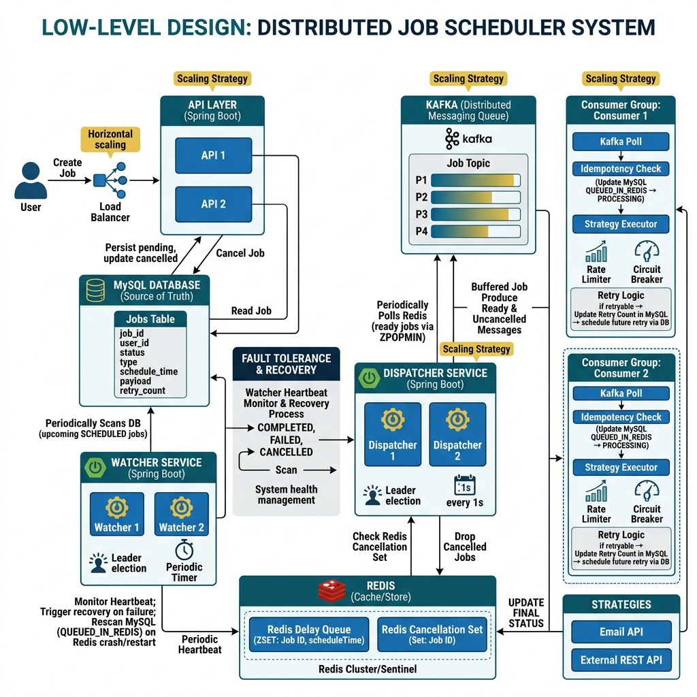

# Job Queue System

A production-grade distributed job scheduling and execution system built with **Spring Boot**, **Apache Kafka**, **Redis**, and **MySQL**. Designed for reliability, scalability, and fault tolerance.

---

## Architecture Overview

### Low-Level Design



### System Flow

```
┌──────────────┐     ┌──────────┐     ┌───────────────────┐     ┌─────────────────┐
│   REST API   │────▶│  MySQL   │◀────│  Watcher Service  │────▶│  Redis Sorted   │
│  (Spring)    │     │  (SoT)   │     │  (every 20s)      │     │  Set (Delay Q)  │
└──────┬───────┘     └──────────┘     └───────────────────┘     └────────┬────────┘
       │                                                                 │
       │ Immediate jobs                                                  │ Ready jobs
       │ (< 60s threshold)                                               ▼
       │                                                        ┌─────────────────┐
       │                                                        │   Dispatcher     │
       │                                                        │  (every 1s)     │
       │                                                        └────────┬────────┘
       │                                                                 │
       ▼                                                                 ▼
┌──────────────────────────────────────────────────────────────────────────────────┐
│                          Apache Kafka (job-topic)                                │
└──────────────────────────────────────────────────────────────────────────────────┘
                                       │
                    ┌──────────────────┼──────────────────┐
                    ▼                  ▼                  ▼
             ┌────────────┐    ┌────────────┐    ┌────────────┐
             │ Consumer 1 │    │ Consumer 2 │    │ Consumer 3 │
             │            │    │            │    │            │
             │ ┌────────┐ │    │ ┌────────┐ │    │ ┌────────┐ │
             │ │Circuit │ │    │ │Rate    │ │    │ │Retry   │ │
             │ │Breaker │ │    │ │Limiter │ │    │ │Backoff │ │
             │ └────────┘ │    │ └────────┘ │    │ └────────┘ │
             └─────┬──────┘    └─────┬──────┘    └─────┬──────┘
                   ▼                 ▼                  ▼
            ┌─────────────────────────────────────────────────┐
            │              Executor Factory                    │
            │    EMAIL          API            LOG             │
            └─────────────────────────────────────────────────┘
```

---

## Tech Stack

| Layer | Technology | Purpose |
|-------|-----------|---------|
| API | Spring Boot 3.3 | REST endpoints, validation, scheduling |
| Database | MySQL | Source of truth for job state |
| Message Queue | Apache Kafka | Async job dispatch, at-least-once delivery |
| Delay Queue | Redis Sorted Set | Time-based job scheduling |
| Cancellation | Redis Key-Value | TTL-based cancellation flags |
| Rate Limiting | Redis + Lua Script | Atomic sliding window rate control |
| Monitoring | Spring Boot Actuator | Health checks, metrics |
| Testing | JUnit 5 + Mockito | Unit tests (13 tests) |

---

## Component Responsibilities

### API Layer (Spring Boot)

- Exposes REST endpoints for users to create and cancel jobs.
- Performs input validation using `@Valid` with `@NotBlank` and `@Pattern` constraints.
- Initializes job state to `PENDING` and persists it to MySQL.
- For immediate jobs (within 60s threshold), dispatches directly to Kafka and sets status to `QUEUED`.
- Handles cancellation requests by setting a TTL-backed flag in Redis.
- Returns consistent error responses via `@RestControllerAdvice` global exception handler.

### MySQL Database (Source of Truth)

- Provides persistent, consistent storage for all jobs and their execution states.
- Ensures data integrity for job lifecycles.
- Stores job metadata: type, payload, email, message, status, retry count, schedule time, next retry time, and idempotency key.
- Uses `@Enumerated(EnumType.STRING)` for type-safe status persistence.

### Watcher Service (Spring Boot)

- Periodically (every 20 seconds) scans the DB for jobs in the upcoming time window (`PENDING` state).
- Pushes identified job IDs and schedules into the Redis Delay Queue (Sorted Set).
- Updates job status in MySQL from `PENDING` → `SCHEDULED`.
- Sends a periodic heartbeat to Redis. A separate mechanism monitors this heartbeat and triggers recovery if the Watcher service fails (handles missed time windows).
- **Gap Recovery**: If a watcher gap is detected (>25s since last run), triggers a recovery scan of the last 60 seconds of missed jobs.

### Redis Delay Queue (Sorted Set)

- An in-memory, high-throughput delay queue structure.
- Uses a Sorted Set (`ZSET`) where the member is the Job ID and the score is the `scheduleTime` (epoch timestamp).
- Stores pending cancellations in separate key-value pairs with 10-minute TTL for the Dispatcher and Consumer to check.

### Dispatcher Service (Spring Boot)

- Periodically (every 1 second) polls the Redis Sorted Set for ready jobs (`score <= current time`).
- Validates job status in MySQL before dispatching (must be `SCHEDULED`).
- Produces ready job messages to the Kafka topic.
- Removes dispatched jobs from the Redis Sorted Set.
- Updates job status from `SCHEDULED` → `QUEUED` before Kafka production.

### Kafka (Distributed Messaging Queue)

- Provides durable, scalable, and decoupled buffering between job dispatching and processing.
- Guarantees asynchronous delivery to consumers.
- Enables parallel processing via `concurrency = "3"` consumer threads.
- Uses manual acknowledgment (`AckMode.MANUAL`) for at-least-once delivery.

### Kafka Consumer Service (Spring Boot)

- Part of a consumer group, subscribing to the Kafka topic.
- Processes job messages pulled from Kafka.
- Implements status-based idempotency to ensure jobs aren't processed multiple times (checks `QUEUED` status before execution).
- Applies appropriate executor strategies via `ExecutorFactory` (Email, API, Log).
- Includes:
  - **Retry logic**: Exponential backoff (`2^retryCount * 1000ms`, capped at 20s) with max 5 retries.
  - **Rate limiting**: Redis-backed sliding window using atomic Lua script (5 requests/second per job type).
  - **Circuit breaker**: Thread-safe implementation using `AtomicInteger`/`AtomicLong`/`volatile`. Opens after 5 consecutive failures, half-opens after 30s timeout.
  - **Cancellation check**: Verifies Redis cancellation flag and clears it after processing.
- Updates final job status (`COMPLETED`, `FAILED`, `RETRY`, `CANCELLED`) in MySQL.

---

## End-to-End Data Flow (Job Lifecycle)

```
PENDING ──▶ SCHEDULED ──▶ QUEUED ──▶ PROCESSING ──▶ COMPLETED
                                         │
                                         ├──▶ RETRY (back to QUEUED via backoff)
                                         ├──▶ FAILED (max retries exceeded)
                                         └──▶ CANCELLED (user-initiated)
```

1. **PENDING**: User creates a job via the API. Job is validated and stored in MySQL with status `PENDING`.
2. **SCHEDULED**: Watcher service scans the DB, finds `PENDING` jobs in the upcoming 20-second window, pushes to Redis Sorted Set.
3. **QUEUED**: Dispatcher polls Redis. If a job's score is past due, it validates and produces to Kafka. For immediate jobs (< 60s), the API layer dispatches directly to Kafka.
4. **PROCESSING**: A Kafka Consumer polls the job. It updates MySQL status to `PROCESSING`, then executes via the correct executor strategy (Email, API, Log).
5. **Final State**:
   - `COMPLETED`: Execution success. DB updated.
   - `FAILED`: Non-retryable failure (max 5 retries exceeded). DB updated.
   - `RETRY`: Retryable failure. Retry count incremented, next retry time set with exponential backoff.
   - `CANCELLED`: User requests cancellation via API. Redis flag checked at consumer, status updated, flag cleared.

---

## Project Structure

```
job-queue/
├── docker-compose.yml                    # Kafka + Zookeeper
├── .env                                  # Environment variables (gitignored)
└── job-queue/
    ├── pom.xml                           # Maven dependencies
    └── src/
        ├── main/java/com/project/job_queue/
        │   ├── JobQueueApplication.java  # Bootstrap with @EnableScheduling, @EnableKafka
        │   ├── config/
        │   │   └── KafkaConfig.java      # Listener container factory (manual ack)
        │   ├── controller/
        │   │   └── JobController.java    # POST /jobs, POST /jobs/{id}/cancel
        │   ├── dto/
        │   │   ├── JobRequest.java       # Request DTO with @Valid constraints
        │   │   └── ErrorResponse.java    # Standard error response DTO
        │   ├── exception/
        │   │   └── GlobalExceptionHandler.java  # @RestControllerAdvice
        │   ├── executer/
        │   │   ├── JobExecutor.java       # Executor interface
        │   │   ├── ExecutorFactory.java   # Strategy pattern resolver
        │   │   ├── EmailExecutor.java     # Sends email via JavaMailSender
        │   │   ├── ApiExecutor.java       # HTTP GET via WebClient
        │   │   └── LogExecutor.java       # Logs job payload
        │   ├── model/
        │   │   ├── Job.java              # JPA entity with @Enumerated status
        │   │   └── JobStatus.java        # Enum: PENDING, SCHEDULED, QUEUED, etc.
        │   ├── repository/
        │   │   └── JobRepository.java    # JPA queries for windowed job fetching
        │   └── service/
        │       ├── JobService.java            # Job creation + immediate dispatch
        │       ├── KafkaConsumerService.java   # Consumer with circuit breaker + retry
        │       ├── KafkaProducerService.java   # Publishes to job-topic
        │       ├── RateLimiterService.java     # Lua-based sliding window
        │       ├── RedisDelayQueueService.java # Sorted set operations
        │       ├── RedisDispatcherService.java # Polls Redis, dispatches to Kafka
        │       ├── RedisService.java           # Cancellation flags with TTL
        │       └── WatcherService.java         # DB scanner + gap recovery
        └── test/java/com/project/job_queue/
            └── service/
                ├── JobServiceTest.java          # 5 unit tests
                └── KafkaConsumerServiceTest.java # 8 unit tests
```

---

## API Endpoints

### Create Job
```
POST /jobs
Content-Type: application/json

{
  "type": "EMAIL",          // Required: EMAIL | API | LOG
  "payload": "data",        // Optional: URL for API type
  "time": "18:30",          // Optional: HH:mm format, omit for immediate
  "email": "user@mail.com", // Required for EMAIL type
  "message": "Hello"        // Required for EMAIL type
}
```

### Cancel Job
```
POST /jobs/{id}/cancel
```

### Health Check (Actuator)
```
GET /actuator/health
GET /actuator/metrics
GET /actuator/info
```

### Validation Error Response
```json
{
  "status": 400,
  "error": "Validation Failed",
  "message": "Request body contains invalid fields",
  "timestamp": "2026-04-28T03:30:00",
  "fieldErrors": {
    "type": "Type must be one of: EMAIL, API, LOG",
    "time": "Time must be in HH:mm format"
  }
}
```

---

## Resilience Patterns

### Circuit Breaker (Thread-Safe)

```
CLOSED ──(5 failures)──▶ OPEN ──(30s timeout)──▶ HALF-OPEN ──(success)──▶ CLOSED
                                                      │
                                                  (failure)
                                                      │
                                                      ▼
                                                    OPEN
```

- Uses `AtomicInteger` for failure count, `AtomicLong` for last failure time, `volatile boolean` for circuit state.
- Safe for `concurrency = "3"` Kafka consumer threads.

### Rate Limiter (Atomic Lua Script)

- Sliding window algorithm implemented as a single Redis Lua script.
- Atomically: removes expired entries → counts current → adds new entry if under limit.
- Default: 5 requests per second per job type.

### Exponential Backoff

```
Retry 1: 2s delay
Retry 2: 4s delay
Retry 3: 8s delay
Retry 4: 16s delay
Retry 5: 20s delay (capped)
After 5: FAILED
```

---

## Scaling Strategy

### Kafka Partitions & Consumers

- Parallel processing is scaled by increasing the number of partitions for the Kafka topic.
- Multiple instances of the Consumer Service are deployed in the same consumer group. Each instance reads from a subset of partitions, allowing horizontal scaling of processing throughput.
- Job ordering can be controlled by choosing an appropriate partitioning key (e.g., Job Type, User ID, or hashing Job ID).

### Redis Usage

- Redis serves as a high-performance, in-memory queue. This offloads frequent polling from MySQL.
- Redis can be scaled using Redis Sentinel (for high availability) or Redis Cluster (for horizontal scalability) to handle high volumes of delay queue operations, rate limiting, and cancellation checks.

### API, Watcher, Dispatcher Services

- These are stateless Spring Boot applications and can be horizontally scaled by deploying multiple instances behind a load balancer (for the API) or using leader election (for Watcher/Dispatcher).
- The Redis heartbeat mechanism ensures recovery for the Watcher.

---

## Fault Tolerance

### Redis Crash Recovery

- MySQL is the source of truth.
- If Redis crashes, the jobs in the Redis Delay Queue are lost.
- Upon Redis recovery, the Watcher service (or its recovery mechanism) re-scans the DB for jobs in the `SCHEDULED` state whose scheduled time has passed and re-adds them to the Redis Sorted Set.
- This effectively rebuilds the delay queue from the persistent DB state.
- The heartbeat monitors the health of the Watcher itself, triggering a full scan on Watcher restart or recovery.

### Kafka Failure Handling

- Kafka replication ensures data durability across multiple brokers.
- The Dispatcher service uses producer retries to handle transient Kafka failures. If Kafka remains down, the jobs stay in the Redis queue or are re-queued from the DB.
- Consumers rely on Kafka's message persistence. If consumers crash, they resume consumption from where they left off when they restart.

### MySQL DB Fallback

- MySQL is the single point of truth. For production, deploy MySQL in a high-availability configuration (e.g., using replication with automatic failover or a database clustering solution).

---

## Design Trade-offs

### DB Polling vs Redis Buffering

| Aspect | Redis Buffering (Chosen) | DB Polling (Alternative) |
|--------|-------------------------|------------------------|
| Complexity | Higher (adds Redis) | Lower (fewer components) |
| MySQL Load | Low (scan every 20s) | High (poll every 1s) |
| Scalability | High (in-memory ops) | Bottleneck on large tables |
| Latency | Sub-millisecond Redis reads | DB query latency |

### Push vs Pull System

| Aspect | Kafka Pull Model (Chosen) | Push Model (Alternative) |
|--------|--------------------------|------------------------|
| Backpressure | Natural (consumers pull at own pace) | Hard to manage |
| Scaling | Add consumers to consumer group | Complex load balancing |
| Retry Handling | Built-in offset management | Custom retry logic needed |
| Decoupling | Full decoupling | Tight coupling |

---

## Production Readiness Checklist

### ✅ Implemented

- [x] Kafka decoupling for async processing
- [x] Exponential backoff retry logic (max 5, capped at 20s)
- [x] Redis-backed sliding window rate limiting (Lua script)
- [x] Thread-safe circuit breaker (AtomicInteger/volatile)
- [x] MySQL as persistent source of truth
- [x] Redis delay queue with sorted set scheduling
- [x] Watcher gap recovery (self-healing)
- [x] Status-based idempotency via `JobStatus` enum
- [x] Cancellation via Redis with TTL + cleanup
- [x] Input validation (`@Valid`, `@Pattern`, `@NotBlank`)
- [x] Global exception handler (`@RestControllerAdvice`)
- [x] Externalized credentials via environment variables
- [x] `.env` gitignored for security
- [x] Spring Boot Actuator (health, metrics, info)
- [x] Constructor-based dependency injection
- [x] Unit tests (13 tests across JobService + KafkaConsumerService)
- [x] Javadoc on all classes and public methods
- [x] SLF4J logging throughout (no System.out)
- [x] Manual Kafka acknowledgment (at-least-once delivery)
- [x] Idempotency key with unique constraint

### 🔲 Planned

- [ ] Dockerfile (multi-stage build)
- [ ] Full docker-compose (app + Kafka + Redis + MySQL + Prometheus + Grafana)
- [ ] CI/CD pipeline (GitHub Actions)
- [ ] Prometheus metrics (Micrometer)
- [ ] Grafana dashboards (job throughput, failure rate, latency)
- [ ] GET endpoints microservice (`/jobs`, `/jobs/{id}`, `/jobs/stats`)
- [ ] Dead Letter Queue (DLQ) for exhausted retries
- [ ] AI Agent microservice (self-healing job recovery)

---

## Running Locally

### Prerequisites

- Java 17+
- Docker (for Kafka, Redis, MySQL)
- Maven

### 1. Start Infrastructure

```bash
docker-compose up -d
```

### 2. Set Environment Variables

Create a `.env` file in the project root:

```env
DB_USERNAME=root
DB_PASSWORD=root123
MAIL_USERNAME=your-email@gmail.com
MAIL_PASSWORD=your-app-password
REDIS_HOST=localhost
REDIS_PORT=6379
KAFKA_BOOTSTRAP_SERVERS=localhost:9092
```

### 3. Run the Application

```bash
cd job-queue
./mvnw spring-boot:run
```

### 4. Run Tests

```bash
./mvnw test
```

---

## License

MIT
